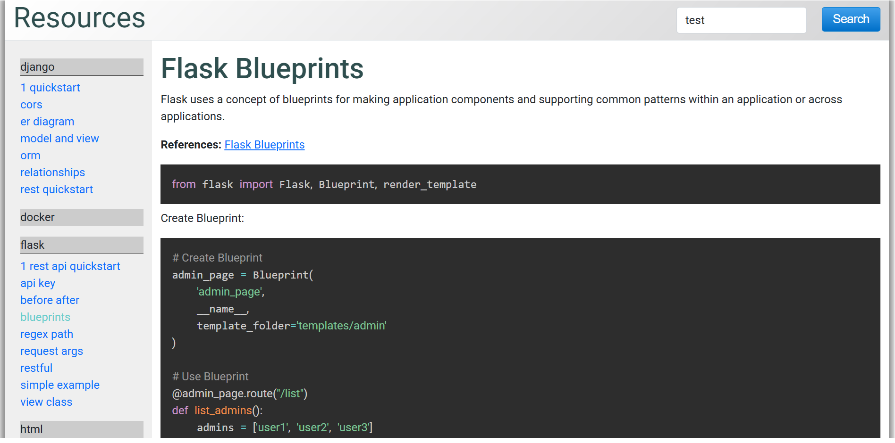

# Introduction

This is a personal project developed to generate HTML websites from Markdown documents. It was originally created as a self-study exercise and predates Obsidian, which I currently use as my preferred documentation tool.

Stack:

- Python
- JQuery
- Vue
- Fuzzysort




# Install/Run instructions

Requires either python or docker. Depending on your running preference.

# How to start the website

While in the project folder:

Option A) 

```bash
cd htdocs
python -m http.server 8000
```
Then open [http://localhost:8000](http://localhost:8000)

Option B)

```bash
docker build -t docs .  
```

The create and run the container

```bash
docker run -d --name docs-container -p 80:80 docs
```

# Update markdown content

The markdown files used as source are located in the data directory.
The naming convention is as follows:

```
[technology]_[filename].md
```

Example:

```
django_cors.md
```

# Generate new static web site

In order to generate a new static website run:

```bash
python generatehtml.py
```

